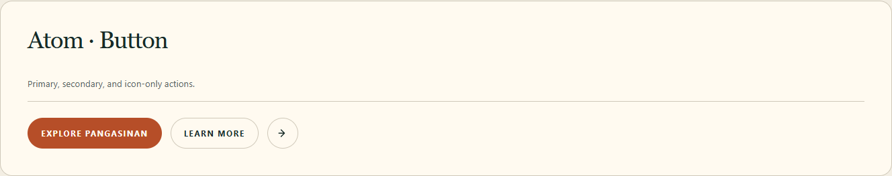
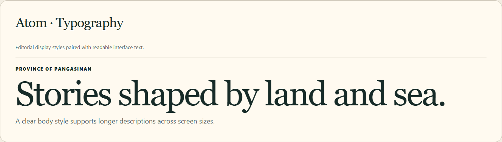
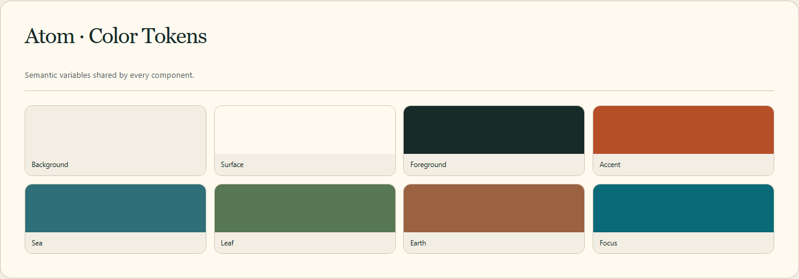
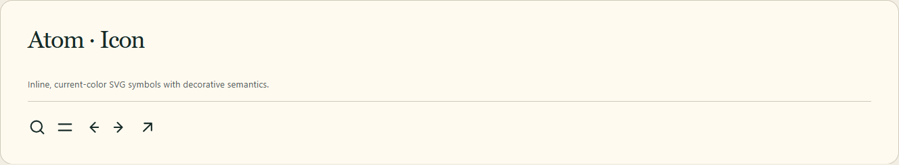
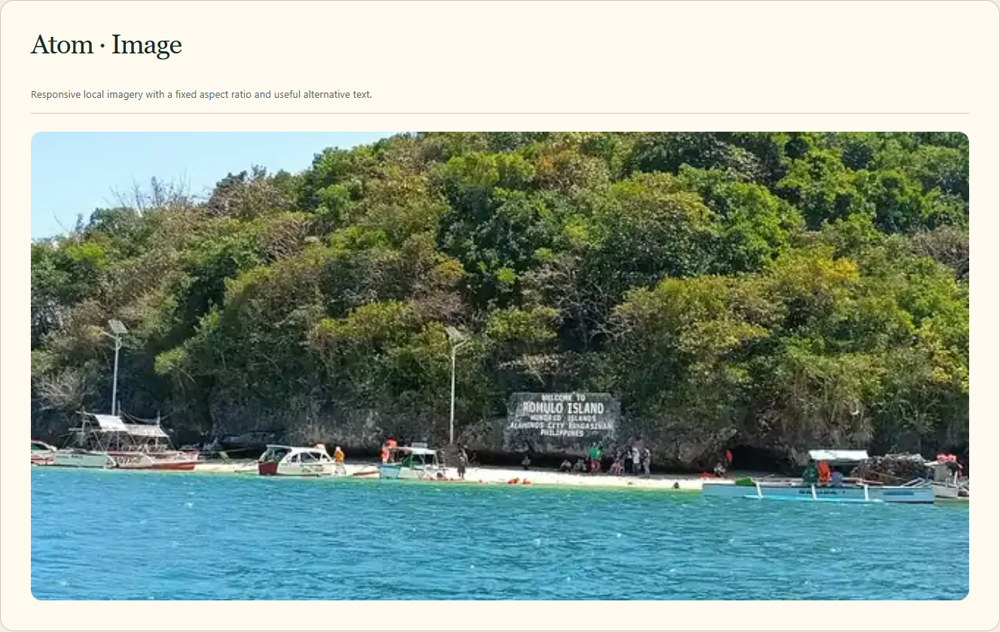
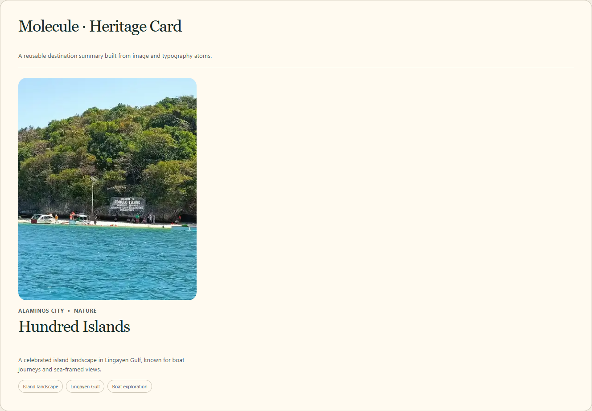
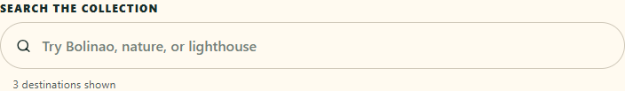
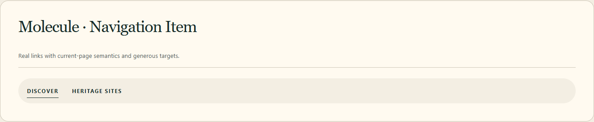
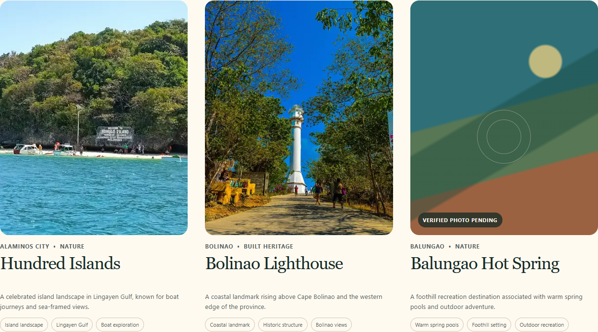
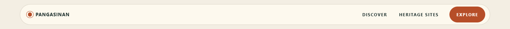

# Atomic Design System Manual

## Pangasinan Heritage Digital Showcase

**Course:** Elective 4 - Special Topics in IT  
**Student:** [STUDENT NAME - replace before submission]  
**Version:** 1.0  
**Method:** Brad Frost's Atomic Design

---

## 1. System Overview

This manual documents the real component implementation used by the Pangasinan Heritage Digital Showcase. The visual previews were captured from `/design-system` while the development application was running; none are fabricated mockups.

The interface uses warm editorial surfaces, a deep coastal green, a terracotta action color, an accessible teal focus color, Georgia-based display typography, and a system sans-serif UI stack. Components are mobile-first and progressively enhance at two shared behavioral breakpoints:

- base/phone: 320px and wider;
- tablet: 48rem / 768px and wider;
- wide desktop grid: 68.75rem / 1100px and wider.

The `--page-gutter`, `--section-space`, and type sizes use `clamp()` so spacing and typography scale continuously between breakpoints. All interactive targets are approximately 44px or larger. Every focusable control receives a visible `:focus-visible` outline. Reduced-motion preferences remove decorative animation while preserving content and controls.

<!-- PAGEBREAK -->

## 2. Atom - Button



### Usage context

Use `Button` for primary calls to action, secondary actions, carousel controls, and the mobile menu. When `href` is supplied it renders a Next.js link; otherwise it renders a native button. `iconOnly` keeps the same target size and requires an accessible label.

### Responsive logic

The atom does not change structure at breakpoints. Its pill shape, minimum height, padding, inline layout, and readable uppercase label work from 320px upward. Parent layouts decide whether buttons wrap. Icon-only controls retain a 2.9rem square target. Hover movement is removed when reduced motion is requested.

### Code reference

```tsx
<Button href="/heritage" variant="primary">
  Explore all sites <Icon name="arrow-up-right" />
</Button>

<Button aria-label="Next destination" iconOnly
  onClick={() => move(1)} variant="secondary">
  <Icon name="arrow-right" />
</Button>
```

<!-- PAGEBREAK -->

## 3. Atom - Typography



### Usage context

Use `Typography` for display titles, section headings, card titles, body copy, labels, and small supporting text. The `as` prop selects the correct semantic element independently of the visual variant, allowing headings to remain logically ordered.

### Responsive logic

Display, heading, title, and body sizes use `clamp()` rather than abrupt device-specific values. Large editorial text begins at a phone-safe size and grows with viewport width. `text-wrap: balance` improves short headings, while body text keeps a 1.65 line height. The system font stack avoids a blocking font download.

### Code reference

```tsx
<Typography as="h1" variant="display">Explore Pangasinan</Typography>
<Typography as="h2" variant="heading">One province, many ways in.</Typography>
<Typography variant="body">Search the heritage collection.</Typography>
```

<!-- PAGEBREAK -->

## 4. Atom - Color Tokens



### Usage context

Semantic CSS variables in `src/styles/tokens.css` provide background, surface, foreground, text, accent, border, focus, overlay, coastal, natural, and sunlight colors. Components reference the semantic role instead of repeating hexadecimal values.

### Responsive logic

Color meaning is stable at every width. Token previews use two columns on phones and four from 768px; consuming components do not need device-specific color overrides. Focus and contrast colors remain distinct on both light editorial surfaces and the deep footer/hero surface.

### Code reference

```css
:root {
  --color-background: #f3eee3;
  --color-surface: #fffaf0;
  --color-text-primary: #172b28;
  --color-accent: #d66b3c;
  --color-focus: #0b6a78;
  --color-deep: #0c292b;
}

.card { background: var(--color-surface); }
```

<!-- PAGEBREAK -->

## 5. Atom - Icon



### Usage context

Use `Icon` for the small set of interface symbols: search, menu, close, directional arrows, and external-direction cues. Icons are inline SVG paths, inherit the surrounding text color, and do not require an icon package.

### Responsive logic

The default 20px symbol is appropriate inside 46px controls. The optional `size` prop supports larger documentation or special contexts without separate assets. Icons are decorative (`aria-hidden`) and the surrounding button or text supplies the accessible name, consistently across screen sizes.

### Code reference

```tsx
<Icon name="search" />
<Button aria-label="Previous destination" iconOnly variant="secondary">
  <Icon name="arrow-left" />
</Button>
```

<!-- PAGEBREAK -->

## 6. Atom - Image



### Usage context

Use `ResponsiveImage` for all verified scenic and heritage photographs. It renders a static-export-safe responsive image, applies the GitHub Pages base path, provides 640px and 1280px WebP candidates, fills a stable container, and requires `alt` and `sizes`. Only critical above-the-fold images receive `priority`; other images load lazily by default.

### Responsive logic

The parent sets an aspect ratio suited to its composition: cards use 4:5 or 16:11, and hero/story media fills the viewport. The `sizes` value tells the browser whether an image occupies one mobile column, half a tablet grid, or one third of a desktop grid. Fixed containers prevent layout shift, and `object-fit: cover` permits controlled cropping without horizontal overflow.

### Code reference

```tsx
<ResponsiveImage
  alt="Cape Bolinao Lighthouse framed by trees"
  className={styles.storyImage}
  sizes="100vw"
  src="/images/bolinao-lighthouse.webp"
/>
```

<!-- PAGEBREAK -->

## 7. Molecule - Heritage Card



### Usage context

Use `HeritageCard` to summarize a typed `HeritageSite` record. It composes Image and Typography atoms with location/category metadata, a short description, and optional highlight pills. The compact form is used in the horizontal carousel; the full form appears in the browsing grid.

### Responsive logic

The card itself is width-agnostic and fills its parent column. Full cards use a portrait 4:5 image; compact carousel cards use 16:11. On mobile the grid supplies one column, on tablet two, and on wide desktop three. If a verified photograph is unavailable, the component renders an explicitly labeled visual placeholder rather than misidentifying an unrelated image.

### Code reference

```tsx
<HeritageCard site={site} />
<HeritageCard compact site={featuredSite} />
```

<!-- PAGEBREAK -->

## 8. Molecule - Search Form



### Usage context

Use `SearchForm` inside the Heritage Grid organism to search name, municipality, province, category, description, and highlights. It provides a visible label, semantic `role="search"`, native search input, hint, and polite live result count.

### Responsive logic

The form is 100% wide inside a parent capped at 44rem, so it remains comfortable on small phones without becoming excessively long on desktops. The field keeps a minimum 3.3rem height for touch input. Placeholder text is supplementary; the visible label remains at every width. Focus-within styling makes keyboard focus easy to locate.

### Code reference

```tsx
<SearchForm
  onSearch={setQuery}
  resultCount={filteredSites.length}
  value={query}
/>
```

<!-- PAGEBREAK -->

## 9. Molecule - Navigation Item



### Usage context

Use `NavigationItem` for primary header destinations. It renders a real Next.js link and accepts `active` to add `aria-current="page"`. The same molecule is reused in desktop and mobile navigation.

### Responsive logic

On desktop the item is a compact uppercase label with an animated underline. In the mobile navigation organism, parent styles enlarge it into an editorial full-width row while preserving the same link semantics. The link retains a minimum 2.75rem target and a global focus outline. Under reduced motion the underline transition becomes immediate.

### Code reference

```tsx
<NavigationItem active={pathname === "/heritage"} href="/heritage">
  Heritage sites
</NavigationItem>
```

<!-- PAGEBREAK -->

## 10. Organism - Heritage Grid



### Usage context

Use `HeritageGrid` as the complete browsing organism on `/heritage`. It owns the query state, composes Search Form and Heritage Card, filters the static site array case-insensitively, and presents a clear no-results state with a real reset button.

### Responsive logic

The grid begins as one column at 320px. At 42rem it becomes two columns, which supports medium tablets without waiting for the global 768px navigation breakpoint. At 68.75rem it becomes three columns. Fluid gaps increase with viewport width. The search remains above the grid and the empty state uses readable bounded content rather than leaving a blank area.

### Code reference

```tsx
const filteredSites = sites.filter((site) =>
  [site.name, site.location, site.category, ...site.highlights]
    .join(" ").toLocaleLowerCase().includes(term)
);

<HeritageGrid sites={heritageSites} />
```

<!-- PAGEBREAK -->

## 11. Organism - Header Navigation



### Usage context

Use `HeaderNavigation` once in the root layout so every route receives the same brand, primary links, active-page indication, and Explore action. It combines Button, Icon, and Navigation Item components.

### Responsive logic

Below 768px the desktop links are replaced by one labeled menu button. Opening the menu prevents background scrolling and moves focus to its first link. Escape closes it and restores focus to the toggle. Crossing the desktop media query closes any open mobile panel. At 768px and above the full navigation and CTA appear inside a centered, blurred pill container. All routes keep a skip link before the header.

### Code reference

```tsx
<HeaderNavigation />

<Button aria-expanded={open} aria-controls="mobile-navigation"
  aria-label={open ? "Close navigation menu" : "Open navigation menu"}
  onClick={() => setOpen((value) => !value)}>
  <Icon name={open ? "close" : "menu"} />
</Button>
```

<!-- PAGEBREAK -->

## 12. Composition Map

```text
RootLayout
  HeaderNavigation (organism)
    Button + Icon (atoms)
    NavigationItem (molecule)

HomePage
  CinematicHero (section)
    ResponsiveImage + Typography (atoms)
  HeritageCarousel (section)
    Button + Icon + Typography (atoms)
    HeritageCard (molecule)

HeritagePage
  HeritageGrid (organism)
    SearchForm (molecule)
      Icon (atom)
    HeritageCard (molecule)
      ResponsiveImage + Typography (atoms)
```

## 13. Accessibility and Maintenance Checklist

- Choose heading elements through the Typography `as` prop based on document order, not desired size.
- Supply useful alt text for meaningful images and empty alt text only for duplicated decorative layers.
- Give every icon-only Button an `aria-label`.
- Preserve visible labels on search inputs.
- Do not turn Heritage Cards into fake buttons; use a real link if detail routes are added later.
- Add colors through semantic tokens and verify contrast before use.
- Keep `"use client"` limited to state, effects, and browser interaction.
- Test at 320, 375, 430, 768, 1024, and 1440px after component changes.
- Verify both ordinary and reduced-motion modes.
- Update this manual only after the real component implementation changes.

## 14. Source Locations

| Layer | Implementation |
| --- | --- |
| Color tokens | `src/styles/tokens.css` |
| Button | `src/components/atoms/Button/` |
| Typography | `src/components/atoms/Typography/` |
| Icon | `src/components/atoms/Icon/` |
| Image | `src/components/atoms/Image/` |
| Heritage Card | `src/components/molecules/HeritageCard/` |
| Search Form | `src/components/molecules/SearchForm/` |
| Navigation Item | `src/components/molecules/NavigationItem/` |
| Heritage Grid | `src/components/organisms/HeritageGrid/` |
| Header Navigation | `src/components/organisms/HeaderNavigation/` |

---

**Verification note:** previews were generated from the live local implementation with the automated script at `scripts/capture-previews.mjs`. Responsive and interaction results are recorded in the project checklist and test evidence.
