# Atomic Design System Manual

## Pangasinan Heritage Digital Showcase

**Course:** Elective 4 - Special Topics in IT

**Student:** [STUDENT NAME - replace before submission]

**Version:** 2.0 - complete active-component audit, 31 August 2026

**Method:** Brad Frost's Atomic Design

---

## 1. Scope and System Overview

This manual documents the component implementation actually used by the Pangasinan Heritage Digital Showcase. Every component preview is an automated, focused crop from a running production route. No `/design-system` mockup and no unrelated demonstration control is used as visual evidence.

The active reusable inventory contains **5 atoms, 4 molecules, 6 organisms/page-level sections, and 2 interaction components**. Color tokens are included as the required foundational atom. `HeritageCarousel` is retained in the repository but is not imported by an active route, so it is disclosed later as inactive rather than represented as production UI.

| Layer | Active items |
| --- | --- |
| Atoms | Button, Typography, Color Tokens, Icon, ResponsiveImage |
| Molecules | HeritageCard, SearchForm, NavigationItem, CategoryFilter |
| Organisms / sections | HeritageGrid, HeaderNavigation, RelatedHeritage, CinematicHero, ExperienceCarousel, SiteFooter |
| Interaction infrastructure | TransitionLink, MotionProvider |

### Shared design foundation

- **Typography:** Playfair Display for editorial headings; Outfit for UI and body copy. Both are loaded through `next/font/google` and exposed as CSS variables, with Georgia and system-sans fallbacks.
- **Palette:** warm paper `#f5f1e8`, ink `#181915`, terracotta `#95513d`, heritage green `#20362b`, and deep green `#17271f`.
- **Responsive model:** mobile-first from 320px; component transitions occur at 42rem (672px), 48rem (768px), 60rem (960px), 62rem (992px), and 68.75rem (1100px) only where needed.
- **Accessibility:** visible focus outlines, semantic links/buttons, approximately 44px minimum targets, labelled controls, keyboard navigation, live search results, useful image alternatives, and reduced-motion fallbacks.

<!-- PAGEBREAK -->

## 2. Atom - Button


### Usage context

This is the real primary call to action near the end of `/`. Use `Button` for primary or secondary navigation, card actions, carousel controls, and reset actions. Supplying `href` renders a route-aware `TransitionLink`; omitting it renders a native button. `iconOnly` preserves a square target and requires an accessible label.

### Responsive logic

The atom keeps the same inline structure at every width. Its minimum height is 3.25rem, and icon-only controls remain 3.25rem square. Parent layouts control wrapping or width. Hover label movement is removed for reduced-motion users.

### Code reference

```tsx
<Button href="/heritage" variant="primary">
  Explore Pangasinan Heritage ->
</Button>
```

<!-- PAGEBREAK -->

## 3. Atom - Typography


### Usage context

This crop is the live introduction to `/heritage`. Use `Typography` for display titles, headings, card titles, body copy, labels, and supporting text. The `as` prop selects the semantic HTML element independently of the visual variant, preserving a correct heading hierarchy.

### Responsive logic

Display, heading, title, and body sizes use `clamp()` so they grow smoothly instead of jumping at device labels. Large editorial text begins at a phone-safe size, short headings use balanced wrapping, and body copy keeps a readable line height. Playfair Display supplies editorial contrast; Outfit supplies clear interface text.

### Code reference

```tsx
<Typography as="h1" variant="display" className={styles.introTitle}>
  Places that<br />carry our stories.
</Typography>
<Typography variant="body" className={styles.introSupport}>
  Browse and discover natural heritage and historic landmarks.
</Typography>
```

<!-- PAGEBREAK -->

## 4. Atom - Color Tokens


### Usage context

This real `/about` section demonstrates the shared paper background, ink headings, terracotta eyebrow/diamonds, muted body text, and subtle borders. Semantic variables in `src/styles/tokens.css` let components request a role rather than repeat a hexadecimal value.

### Responsive logic

Color meaning and contrast stay stable at every width. In the pictured classification composition, blocks are one column on phones, two columns from 48rem, and four columns from 60rem. Layout changes, but the same semantic colors continue to communicate hierarchy.

### Code reference

```css
:root {
  --color-background: #f5f1e8;
  --color-foreground: #181915;
  --color-text-secondary: #65655d;
  --color-accent: #95513d;
  --color-deep: #20362b;
  --color-deep-dark: #17271f;
  --color-on-dark: #fafaf7;
  --color-border: rgba(24, 25, 21, 0.12);
}
```

<!-- PAGEBREAK -->

## 5. Atom - Icon


### Usage context

These are the real previous/next arrows in the "Ways into the province" carousel on `/`. Use `Icon` for search, close, directional arrows, and external-direction cues. The component renders inline SVG paths, inherits the surrounding control color, and needs no third-party icon package.

### Responsive logic

The default symbol remains 20px while its icon-only Button supplies a 3.25rem target. Icons are decorative with `aria-hidden`; the Button provides names such as "Previous experience" and "Next experience". Card widths change around the controls, but the symbol and target remain stable.

### Code reference

```tsx
<Button aria-label="Previous experience" disabled={active === 0}
  iconOnly onClick={() => moveTo(active - 1)} type="button"
  variant="ghost">
  <Icon name="arrow-left" />
</Button>
```

<!-- PAGEBREAK -->

## 6. Atom - Responsive Image


### Usage context

This is the real Cape Bolinao Lighthouse feature on `/`. Use `ResponsiveImage` for verified scenic and heritage photographs. It renders a static-export-safe native image, applies the GitHub Pages base path, provides local responsive candidates, requires `alt` and `sizes`, and lazily loads noncritical images. Only above-the-fold images receive `priority`.

### Responsive logic

The pictured feature stacks into one column on phones with a portrait 4:5 image. From 48rem it becomes a 7/5 two-column composition and the image changes to 4:3. The `sizes` hint changes the expected width from 100vw to 75vw. Width and height reserve space while the parent controls crop and focal point.

### Code reference

```tsx
<ResponsiveImage
  alt="Cape Bolinao Lighthouse framed by trees"
  className={styles.bolinaoImage}
  sizes="(max-width: 767px) 100vw, 75vw"
  src="/images/bolinao-lighthouse.webp"
/>
```

<!-- PAGEBREAK -->

## 7. Molecule - Heritage Card


### Usage context

This is the first actual result on `/heritage`. `HeritageCard` summarizes one typed `HeritageSite` record with image, index, place, classification, description, and route action. It composes `ResponsiveImage`, `Button`, and `Icon`. Type A uses a verified photograph; Type B supplies a text-first fallback where no reliable photograph is available.

### Responsive logic

The molecule fills its parent column. Image cards use a 4:3 frame; text-first cards use a 24rem minimum height. The parent archive grid supplies one, two, or three columns. Descriptions clamp to three lines, and reduced-motion mode removes image zoom and lift without removing content.

### Code reference

```tsx
{filteredSites.slice(0, visibleCount).map((site, index) => (
  <HeritageCard key={site.id} headingLevel="h2"
    priority={index === 0} site={site} index={index} />
))}
```

<!-- PAGEBREAK -->

## 8. Molecule - Search Form


### Usage context

This is the production search at the top of `/heritage`, initially reporting all 41 places. Use it inside `HeritageGrid` to search the name, municipality, province, class/type, description, and highlights. It supplies a visible label, `role="search"`, native search field, clear control, and polite live result count.

### Responsive logic

The form is 100% wide inside a search area capped at 58rem. The underlined field keeps a 4.25rem minimum height, the clear control keeps a 2.75rem target, and input type scales with `clamp()`. The visible label and live count remain available at all widths.

### Code reference

```tsx
<SearchForm
  onClear={() => setQuery("")}
  onSearch={setQuery}
  resultCount={filteredSites.length}
  value={query}
/>
```

<!-- PAGEBREAK -->

## 9. Molecule - Navigation Item


### Usage context

This crop comes from the real full-screen navigation opened below the desktop breakpoint. `NavigationItem` renders a route-aware `TransitionLink`, adds `aria-current="page"` when active, and accepts `onClick` so the panel closes after selection.

### Responsive logic

The base item is a compact uppercase label with a 2.75rem minimum target and underline. In the small-screen overlay, Header Navigation enlarges the same link into an editorial full-width row and removes the underline. Focus remains visible, and reduced-motion mode removes transition effects.

### Code reference

```tsx
<NavigationItem active={pathname === item.href} href={item.href}
  onClick={() => setOpen(false)}>
  {item.label}
</NavigationItem>
```

<!-- PAGEBREAK -->

## 10. Molecule - Category Filter

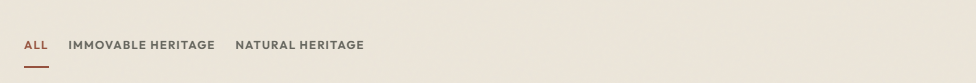

### Usage context

This is the live heritage-class filter directly below search on `/heritage`. Use it only where a collection needs one mutually exclusive category selection. Categories are derived from actual records. Every option is a native button, and `aria-pressed` exposes the selected state to assistive technology.

### Responsive logic

The filter uses a wrapping flex row rather than a device-specific layout. At narrow widths, options wrap onto additional rows while retaining 2.75rem minimum targets. The active item is communicated through terracotta text and underline as well as `aria-pressed`, so state is not color-only.

### Code reference

```tsx
<div role="group" aria-label="Filter by heritage class">
  <button type="button" aria-pressed={activeCategory === "All"}
    onClick={() => onSelect("All")}>All</button>
  {categories.map((category) => (
    <button key={category} type="button"
      aria-pressed={activeCategory === category}
      onClick={() => onSelect(category)}>{category}</button>
  ))}
</div>
```

<!-- PAGEBREAK -->

## 11. Organism - Heritage Grid


### Usage context

This is the complete production browsing organism on `/heritage`: search, category filtering, result count, and archive cards. `HeritageGrid` owns query, category, and visible-count state; composes `SearchForm`, `CategoryFilter`, `HeritageCard`, and `Button`; filters case-insensitively; reveals records in groups of 12; and provides a resettable no-results state.

### Responsive logic

The result grid is one column by default, two columns from 42rem, and three columns from 68.75rem. Fluid gaps increase with available space. Search and filters remain above the result grid. The empty state uses bounded readable copy instead of leaving a blank collection.

### Code reference

```tsx
const filteredSites = useMemo(() => {
  let filtered = activeCategory === "All" ? sites
    : sites.filter((site) => site.heritageClass === activeCategory);
  const term = query.trim().toLocaleLowerCase();
  if (!term) return filtered;
  return filtered.filter((site) =>
    [site.name, site.location, site.heritageClass,
      site.shortDescription, ...site.highlights]
      .join(" ").toLocaleLowerCase().includes(term));
}, [query, sites, activeCategory]);
```

<!-- PAGEBREAK -->

## 12. Organism - Header Navigation


### Usage context

This is the shared header as visitors see it above `/heritage`. `HeaderNavigation` appears once in the root layout and serves every route. It combines route-aware links, `NavigationItem`, responsive preview imagery, and a native menu button.

### Responsive logic

Below 60rem, centered desktop links become a labelled menu button; the overlay image/Explore treatment appears from 48rem. Opening the menu prevents background scroll, focuses the first link, traps Tab focus, closes with Escape, and restores toggle focus. At 60rem the centered desktop navigation replaces the toggle. The fixed header hides on downward scroll and returns on upward scroll or keyboard focus.

### Code reference

```tsx
// src/app/layout.tsx
<HeaderNavigation />

<nav aria-label="Primary navigation" className={styles.desktopNav}>
  <TransitionLink href="/">Home</TransitionLink>
  <TransitionLink href="/heritage">Heritage</TransitionLink>
  <TransitionLink href="/about">About</TransitionLink>
</nav>
```

<!-- PAGEBREAK -->

## 13. Organism - Related Heritage

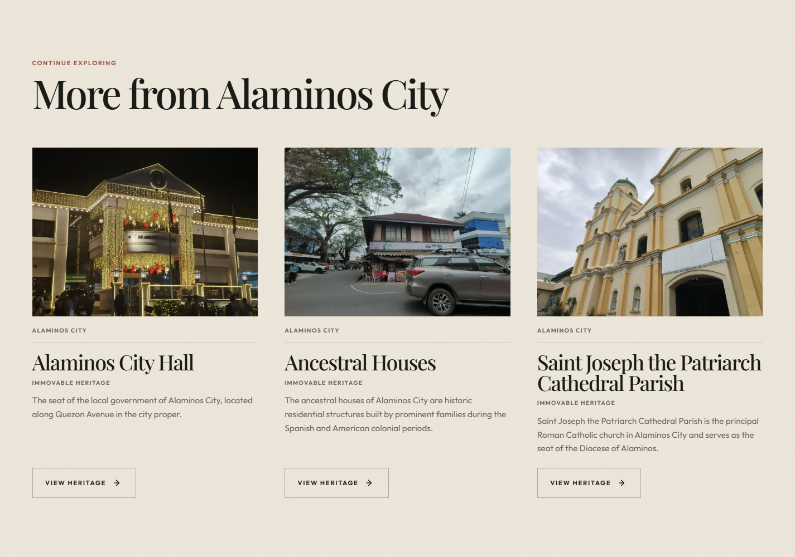

### Usage context

This is the real "More from Alaminos City" section on `/heritage/hundred-island/`. Use `RelatedHeritage` on a heritage detail route to continue discovery with records chosen by the page's related-site logic. The organism maps typed `HeritageSite` data into reusable `HeritageCard` molecules.

### Responsive logic

The grid starts with one card per row, becomes two columns from 42rem, and three columns from 68.75rem. Gaps scale with `clamp()`. Each card retains its internal 4:3 media ratio, bounded copy, and full keyboard-accessible link.

### Code reference

```tsx
export function RelatedHeritage({ sites }: RelatedHeritageProps) {
  return (
    <div className={styles.grid}>
      {sites.map((site) => (
        <HeritageCard key={site.id} site={site} />
      ))}
    </div>
  );
}
```

<!-- PAGEBREAK -->

## 14. Page-level Organism - Cinematic Hero

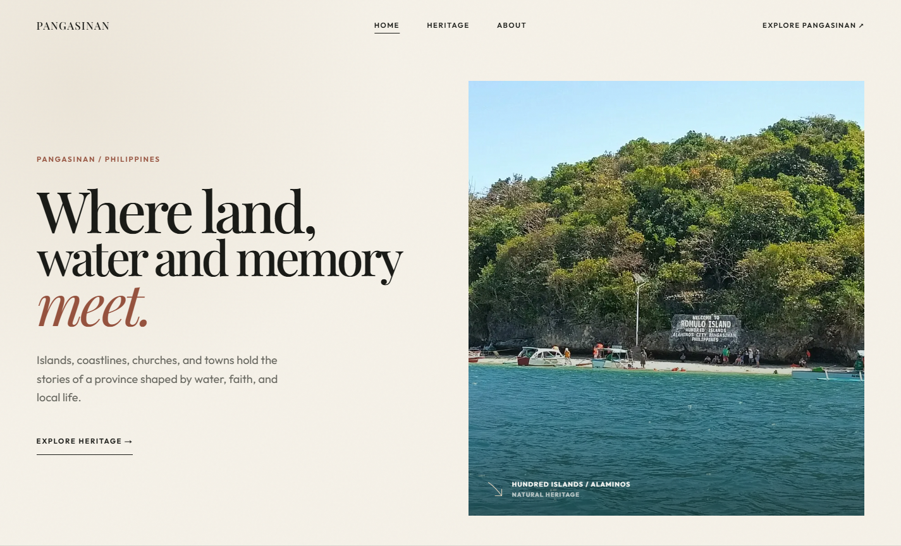

### Usage context

This is the actual opening of `/`. `CinematicHero` introduces Pangasinan with one clear message, a heritage image, contextual classification, and a route action. It composes `ResponsiveImage` with semantic section, heading, paragraph, and link elements.

### Responsive logic

Phones use a single-column flow with a 16:11 image after the copy. From 48rem, the hero becomes two columns (`1.04fr / 0.96fr`), the image becomes 4:5 with a 43rem maximum height, and content receives centered-site gutters. Below 30rem, the title uses a tighter phone scale. The image `sizes` value changes from 100vw to 45vw.

### Code reference

```tsx
<section aria-label="Welcome to Pangasinan" className={styles.hero}>
  <h1 className={styles.title} data-reveal="fade-up">
    <span>Where land,</span>
    <span>water and memory</span>
    <span><em>meet.</em></span>
  </h1>
  <ResponsiveImage priority sizes="(max-width: 767px) 100vw, 45vw"
    alt="Hundred Islands National Park"
    src="/images/hundred-islands.webp" />
</section>
```

<!-- PAGEBREAK -->

## 15. Page-level Organism - Experience Carousel

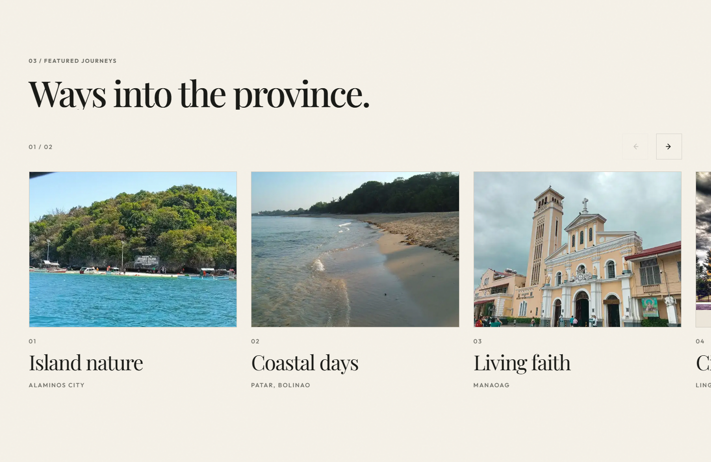

### Usage context

This is the live "Ways into the province" feature on `/`. `ExperienceCarousel` combines responsive cards, images, `TransitionLink`, `Button`, and `Icon`. It tracks the current reachable scroll stop, updates a polite position counter, supports previous/next controls, touch/trackpad scrolling, and Left/Right Arrow keys.

### Responsive logic

Cards use up to 86vw/26rem on phones, 46vw/27rem from 48rem, and 29vw/27rem from 68.75rem. The horizontal track uses native overflow, start-aligned scroll snap, and smooth movement. Controls calculate and deduplicate the stops that can actually be reached at the current viewport, preventing tiny or repeated arrow movements. Smooth scrolling becomes immediate when reduced motion is requested.

### Code reference

```tsx
<div role="region" tabIndex={0}
  aria-label="Ways to experience Pangasinan"
  className={styles.track}
  onKeyDown={(event) => {
    if (event.key === "ArrowLeft") moveBy(-1);
    if (event.key === "ArrowRight") moveBy(1);
  }}>
  {items.map((item) => (
    <TransitionLink className={styles.card} href={item.href}
      key={item.title}>{/* image and metadata */}</TransitionLink>
  ))}
</div>
```

<!-- PAGEBREAK -->

## 16. Page-level Organism - Site Footer

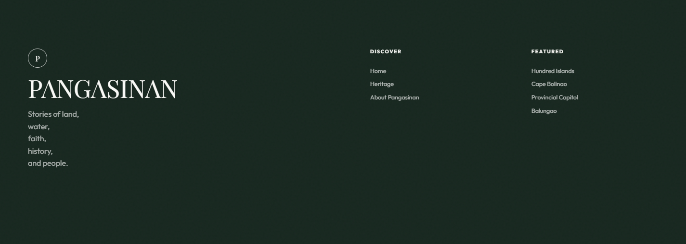

### Usage context

This is the shared footer rendered on Home, Heritage, About, and every heritage detail page. It closes each route with project identity, primary navigation, and featured destinations. It composes `Typography` and `TransitionLink` and uses semantic footer/headings/link markup.

### Responsive logic

Wide screens use a large brand column plus two link columns. Below 62rem the brand spans a full first row over three equal columns. Below 40rem the layout becomes two columns; the brand and legal row span both columns, the final link group receives its own row, and the bottom metadata stacks vertically. Reduced motion removes link movement.

### Code reference

```tsx
<footer className={styles.footer}>
  <div className={styles.inner}>
    <div className={styles.brandBlock}>
      <Typography as="h2" variant="heading">PANGASINAN</Typography>
    </div>
    <div className={styles.linkGroup}>
      <h3>DISCOVER</h3>
      <TransitionLink href="/">Home</TransitionLink>
      <TransitionLink href="/heritage">Heritage</TransitionLink>
      <TransitionLink href="/about">About Pangasinan</TransitionLink>
    </div>
  </div>
</footer>
```

<!-- PAGEBREAK -->

## 17. Interaction Component - Transition Link

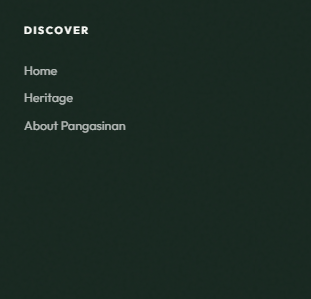

### Usage context

The preview shows the real Discover links inside `SiteFooter`. Use `TransitionLink` for internal navigation that should participate in the site's cinematic route transition. It remains a Next.js `Link`, preserves ordinary browser behavior for modifier clicks, new tabs, hashes, external protocols, and prevented events, and delegates valid internal navigation to `MotionProvider`.

### Responsive logic

`TransitionLink` has no visual layout of its own; it inherits the size and wrapping of its consumer. The footer links shown rearrange with the footer grid. If reduced motion is enabled or either route is non-cinematic, navigation proceeds immediately without the curtain.

### Code reference

```tsx
const handleClick = (event: MouseEvent<HTMLAnchorElement>) => {
  onClick?.(event);
  if (event.defaultPrevented || event.button !== 0 || event.metaKey
    || event.ctrlKey || target === "_blank" || href.startsWith("#")
    || /^[a-z]+:/i.test(href)) return;
  event.preventDefault();
  beginNavigation(href);
};
```

<!-- PAGEBREAK -->

## 18. Interaction Component - Motion Provider


### Usage context

This is the real transition curtain captured during Home-to-Heritage navigation, not a static mockup. `MotionProvider` wraps the application in `RootLayout`. It provides transition state to `TransitionLink`, reveals elements entering the viewport, observes dynamically added reveal elements, and updates restrained parallax values.

### Responsive logic

Reveal behavior is content-driven at all widths. Parallax runs only from 768px when reduced motion is not requested. The curtain covers for 380ms, reveals for 680ms, and has an 1800ms safety fallback. Reduced-motion mode bypasses the curtain, reveals all content immediately, disables parallax, and uses direct routing.

### Code reference

```tsx
// src/app/layout.tsx
<MotionProvider>
  <HeaderNavigation />
  {children}
</MotionProvider>

const beginNavigation = useCallback((href: string) => {
  if (prefersReducedMotion() || !isCinematicRoute(pathname)) {
    router.push(href);
    return;
  }
  setPhase("covering");
  navigationTimer.current = window.setTimeout(() => router.push(href), 380);
}, [pathname, router]);
```

<!-- PAGEBREAK -->

## 19. Composition and Dependency Map

```text
RootLayout
  MotionProvider (interaction infrastructure)
    HeaderNavigation (organism)
      NavigationItem (molecule)
        TransitionLink (interaction infrastructure)

HomePage
  CinematicHero -> ResponsiveImage
  ExperienceCarousel -> Button + Icon + ResponsiveImage + TransitionLink
  SiteFooter -> Typography + TransitionLink

HeritagePage
  HeritageGrid
    SearchForm -> Icon
    CategoryFilter
    HeritageCard -> ResponsiveImage + Button + Icon
  SiteFooter

HeritageDetailPage
  ResponsiveImage + Button + Icon
  RelatedHeritage -> HeritageCard
  SiteFooter

AboutPage
  ResponsiveImage + Button + Icon
  SiteFooter
```

### Route-owned compositions

Some semantic sections are intentionally authored inside page files rather than exported as library components: the Home province story, Cape Bolinao feature, image journey, heritage categories, and final CTA; the Heritage archive introduction; the detail-page hero/facts/story/location sections; and the About hero, identity, classification, project, and CTA sections. They reuse shared tokens and atoms but are not falsely counted as standalone components.

### Active/inactive audit

All 17 items documented on pages 2-18 are imported by an active route or by another active component. `src/components/sections/HeritageCarousel/` currently has no importer and is therefore **inactive/legacy**. It is not represented with a live component crop and should be removed later if it is not planned for reuse.

<!-- PAGEBREAK -->

## 20. Responsive and Accessibility Verification Matrix

| Concern | Implemented behavior | Verification |
| --- | --- | --- |
| Minimum viewport | Body minimum is 20rem / 320px | Automated horizontal-overflow checks at 320px |
| Archive layout | 1 column; 2 at 42rem; 3 at 68.75rem | Live viewport checks through 1920px |
| Header | Menu below 60rem; desktop navigation at 60rem | Toggle, focus entry, Escape close tested |
| Search | Case-insensitive multi-field filtering | "BOLINAO" returns four records |
| Empty state | Message and Clear filters action | Reset restores first 12 records |
| Keyboard | Native links/buttons, visible focus, carousel arrows | Interactive checks and semantic markup |
| Images | Required alt/sizes; lazy by default | Live production assets loaded before capture |
| Motion | Reveal/parallax/curtain progressively enhanced | Reduced-motion content is immediately visible |

Maintenance rules:

- Choose semantic heading levels independently from visual size.
- Give every icon-only Button an `aria-label`.
- Preserve visible search labels and polite result announcements.
- Add colors only through semantic tokens and recheck contrast.
- Keep `"use client"` limited to state, effects, and browser interaction.
- Regenerate previews from the real routes after UI changes.
- Test 320, 390, 768, 1024, 1440, and 1920px, including reduced motion.

<!-- PAGEBREAK -->

## 21. Live Route Evidence - Home

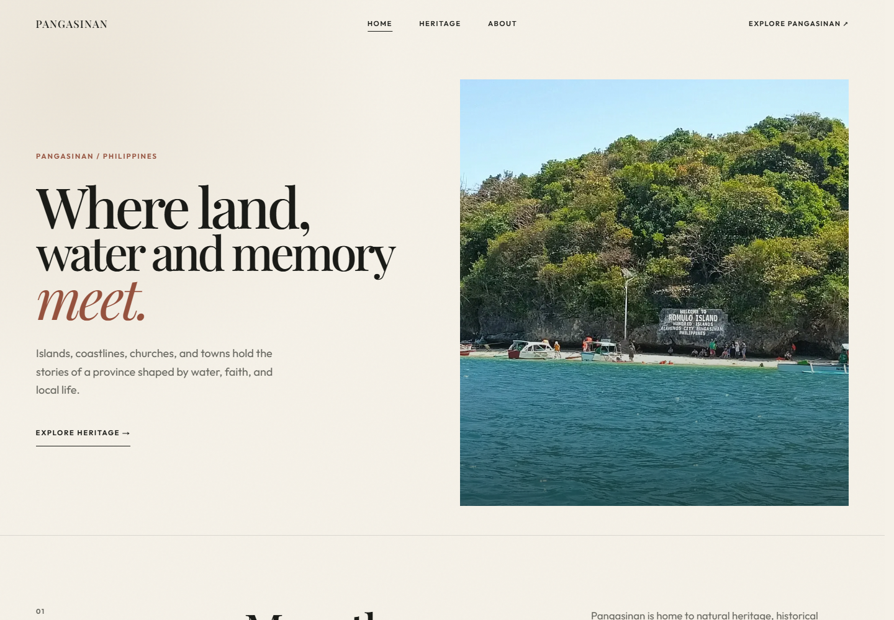

The Home route composes the shared header, Cinematic Hero, editorial province sections, Experience Carousel, final Button CTA, and Site Footer. A full-length source capture is also retained as `previews/home-desktop.png`.

<!-- PAGEBREAK -->

## 22. Live Route Evidence - Heritage Archive

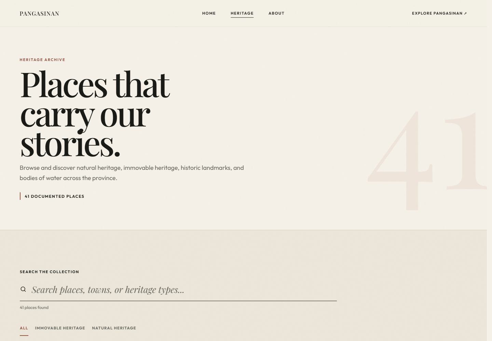

The archive route shows the shared header, Typography-led introduction, Search Form, Category Filter, Heritage Grid/Card system, load-more behavior, and shared Site Footer using the real 41-record dataset. A full-length capture is retained as `previews/heritage-desktop.png`.

<!-- PAGEBREAK -->

## 23. Live Route Evidence - About

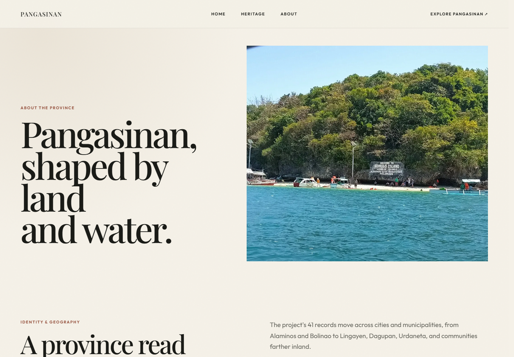

The About route demonstrates the shared tokens, type system, Responsive Image atom, classification composition, project explanation, CTA/Button treatment, and Site Footer in a separate editorial context. A full-length capture is retained as `previews/about-desktop.png`.

<!-- PAGEBREAK -->

## 24. Mobile Route Evidence - Home

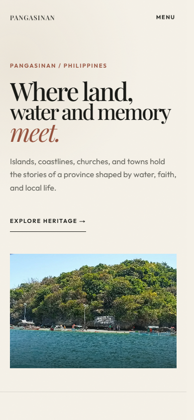

This production capture verifies the Home components at the 390px small-screen layout. The complete scrolling page is retained as `previews/home-mobile.png`.

<!-- PAGEBREAK -->

## 25. Mobile Route Evidence - Heritage

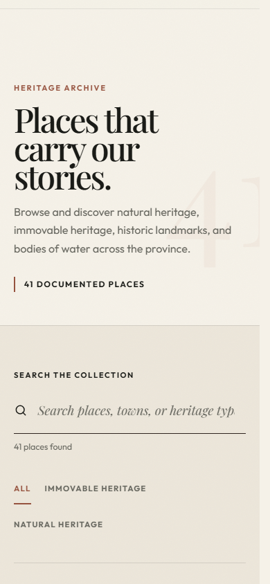

This production capture verifies the archive introduction, search, wrapping category filters, and one-column card layout. The complete scrolling page is retained as `previews/heritage-mobile.png`. Automated checks additionally cover 320, 768, 1024, 1440, and 1920px and reject horizontal overflow.

<!-- PAGEBREAK -->

## 26. Source Locations

| Layer | Implementation |
| --- | --- |
| Tokens and global motion | `src/styles/tokens.css`; `src/app/globals.css` |
| Button | `src/components/atoms/Button/` |
| Typography | `src/components/atoms/Typography/` |
| Icon | `src/components/atoms/Icon/` |
| ResponsiveImage | `src/components/atoms/Image/` |
| HeritageCard | `src/components/molecules/HeritageCard/` |
| SearchForm | `src/components/molecules/SearchForm/` |
| NavigationItem | `src/components/molecules/NavigationItem/` |
| CategoryFilter | `src/components/molecules/CategoryFilter/` |
| HeritageGrid | `src/components/organisms/HeritageGrid/` |
| HeaderNavigation | `src/components/organisms/HeaderNavigation/` |
| RelatedHeritage | `src/components/organisms/RelatedHeritage/` |
| CinematicHero | `src/components/sections/CinematicHero/` |
| ExperienceCarousel | `src/components/sections/ExperienceCarousel/` |
| SiteFooter | `src/components/sections/SiteFooter/` |
| TransitionLink | `src/components/motion/TransitionLink/` |
| MotionProvider | `src/components/motion/MotionProvider/` |

---

**Verification statement:** all component images are automated crops from live production routes. The manual includes every active reusable component and explicitly separates route-owned compositions and inactive legacy code.
